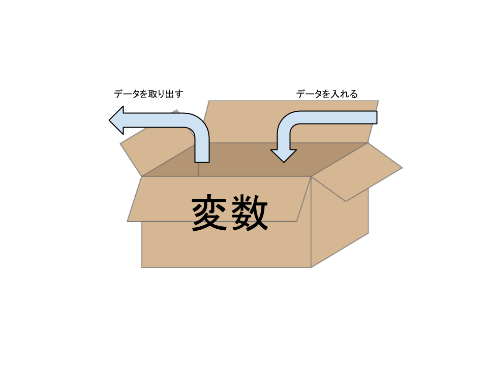
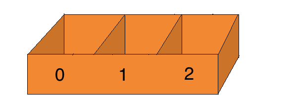

## はじめてのRuby
## プログラミング
  第2回 hommachirb
___
### 自己紹介
- 名前 tomcha
- twitter @tomcha_
- blog Perlがくしゅう帳(Rubyも)

___
- 仕事は事務員
- 仕事ではもっぱらWordとExcel
- 趣味でプログラミング
___
### 今日の内容
- Rubyのプログラムの書き方
- Rubyの動かし方
- 画面に文字を表示させる
- 変数の使い方
- 文字を入力する
- 入力した文字を加工して表示させる
---
### Rubyのプログラムの書き方

    ファイル名.rb
と名前を付けるのがセオリー

___
### おまじない
    #!/usr/bin/env ruby
    # coding: utf-8

- 上の行は1行目に書く。書くことにより実行を簡略化できる。
- 下の行は"utf-8"という書式でプログラムが書かれてますよというしるし。
  - (windowsだとshift_jisなど)
  - (無くても良い？ベテランの皆さん、どうしてますか？)
---
### Rubyの動かし方

    $> ruby ファイル名.rb

- と書いてプログラムが書かれたファイルを実行する。  
- おまじないの1行名を書いていれば、以下のコマンドで "ruby" を省略して実行できる。（ファイル名だけで実行できる）

    $> chmod +x ファイル名.rb
---
### 画面に文字を表示させる命令
- print
  - 改行が自動で付かない
- puts
  - 改行が自動で付く
- p
  - 厳密には文字ではなく、"情報"を出力する命令

改行を表す文字は"\n"（バックスラッシュ又は¥マーク）  
Rubyでは、命令の事を"メソッド"と言います。
___
### 書いてみよう
画面に自分の名前を表示する

    print "私の名前は@tomcha_です。"

    puts "私の名前は@tomcha_です。"

    p "私の名前は@tomcha_です。"

出力する文字列は " " か ' ' で囲みます。
___
### 練習問題
自分の名前を出力するコードを書いて実行してみよう。

- ファイルを書くディレクトリを作るコマンド
  - cd 移動先ディレクトリ名
  - mkdir ディレクトリ名
- ファイルを作るコマンド
  - touch ファイル名

    \# coding: utf-8
    puts "出力する内容"

    $> ruby ファイル名.rb

[解答例](https://gist.github.com/tomcha/380a4556036699221165)
---
### 変数の使い方

- 変数とは、一時的にデータを入れておく箱のようなもの

___
使い方

    変数名 = データ

=　は'等しい'ではなく、'〜に入れる（〜は）'と読むとわかり易い。

    box = "data"

- 変数名はアルファベット小文字又は_で始めます。
- その他（インスタンス変数、クラス変数）というものがあり、別の命名規則がありますが、今は置いておきましょう。
___
- 配列(Array)は複数入れることが出来る箱
  - 先頭から番号で数える
  - 0から始める

___
使い方

    配列名 = [データ, データ, データ]

    array = [100, 200, 300, "四百"]

- データは、文字・文字列は"や'で囲む。数字は囲まない。データは , で区切る。

- 中身を参照する時は、配列名[番号]で参照する。  

- 番号を指定して1つの中身を書き換える事ができる。

    array[1] = 500

    puts array[1]

___
変数や配列は、puts や print の命令で使うと、中身のデータを扱う事ができる

    box = 'data'

    print box

"data"が出力される

    array = [100, 200, 300, '四百']

    puts array[3]

四百が画面に出力される
___
### 練習問題
- 自分の好きな食べ物を３つ、３つの変数を用意して入れてみよう
- ３つの変数の中身をそれぞれ画面に出力してみよう
- 変数の代わりに配列を用意して、３種類の動物を入れてみよう
- 配列に入れた３種類の動物をそれぞれ画面に出力してみよう

[解答例](https://gist.github.com/tomcha/1c33a6d3c01ae13723bc)
___
- 連想配列(Hash ハッシュと読む)は”名札（ラベル）”をつけて管理できる配列です。
  - 名札とデータの１対を指定してやる
  - 格納した順番は1.9以降保証される様になった。

___
使い方

- ”名札”と”データ”は、keyとvalueと言います。

    ハッシュ名 = {key1 => データ, key2 => データ, key3 => データ}

    hash = {'name' => 'tomcha', 'hobby' => 'プログラミング', 'food' => '衣笠丼'}

- 中身を参照する時は、ハッシュ名[key]で参照する。  
- keyは重複してはいけない。(というか、同じkeyを使うと後からのデータで上書きされる)

    hash['hobby'] = 'play drum'

    hash['hobby'] = 'programing'
___
### 練習問題
- 自分の名前(name)、趣味(hobby)、好きな食べ物(food)を格納したpersonという名前のハッシュを作ってみよう
- 作ったpersonから名前、趣味、好きな食べ物のデータを取り出して画面に出力してみよう。

[解答例](https://gist.github.com/tomcha/8ca063002d9dcdf2e309)
___
### 文字を入力する
- ターミナルからの文字入力を受け取り、その値を返すメソッド

    gets

- 返すとは・・・評価した値を返す。命令して仕事をさせて、その成果物をもらうイメージ。
___
そのまま画面に出力するなら

    print gets

変数や配列に代入する事も出来ます。

    box = gets

    array[0] = gets
___
### 注意点
- エンターで入力終了となる為、改行文字までが値に含まれます。入力された文字を扱う時は改行文字を削除する必要があります。
- "\n"が改行の文字を表します。
- 末尾の改行文字を取り除くメソッド、chomp! 又は chompを使います。
- メソッドは "何か" に対して命令します。

    "何か".メソッド

- "何か"の事を"オブジェクト"と言います。
___
### 改行文字の推移を実際に確かめてみましょう

    str = gets
    p str

    str.chomp
    p str

    str.chomp!
    p str

- !が付くと元のデータが書き換え
- !が付かないと元のデータはそのまま
___
### 文字列操作
- 文字列は、+ で連結できます。  
- 変数を使う事もできます。
- 変数を使う場合は、 + で連結したり、" " の中に埋め込む事もできます。( #{}を使う)

    name = 'tomcha'

    puts '私の名前は' + name + 'です。'

    puts "私の名前は#{name}です。"
___
### 練習問題
対話して名前を表示するプログラムを作ってみましょう。
   
1. 'あなたの名前は？'と画面に出力する。
2. ユーザーが名前を入力する。
3. 'あなたは、◯◯さんですね。'と答える

[解答例](https://gist.github.com/tomcha/9f28497dec956eec2abd)
---
Let's enjoy programing!
